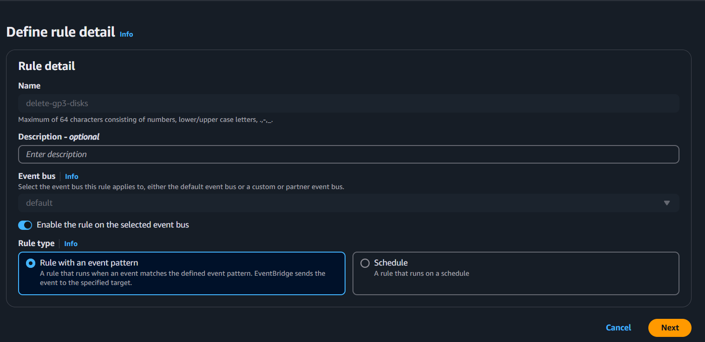
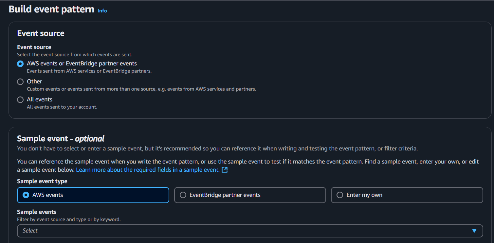
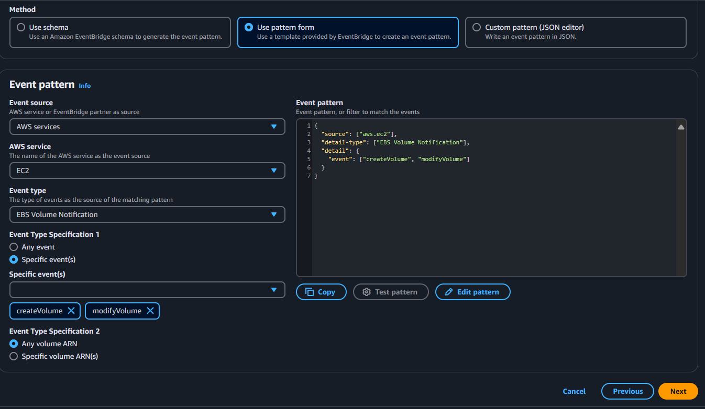

## Delete unattached EBS volumes using event bridge and lambda function

### Prerequisites
* An IAM role with EC2FullAccess.

1. Create a EventBridge rule with target as Lambda function.





2. Add the below code while creating the lambda fuction. Also attach the created IAM role to the Lambda function under Configuration->Permissions

```python
import json
import boto3 
import time
def lambda_handler(event, context):
    client = boto3.client("ec2", region_name="ap-south-1")
    resp = client.describe_volumes().get("Volumes", [])
    unattachedvols = []
    time.sleep(15)
    for vol in resp:
        if len(vol["Attachments"]) == 0:
            volid = vol["VolumeId"]
            print(f"Volume {volid} is not attached and will be deleted")
            unattachedvols.append(vol["VolumeId"])
        else:
            volid = vol["VolumeId"]
            """print(f"Volume {volid} is attached")"""

    print(f"The Volumes which are availible are {unattachedvols}")
    ec2_resource = boto3.resource("ec2", region_name="ap-south-1")
    for vol in unattachedvols:
        print(vol)
        volume = ec2_resource.Volume()
        volume.delete()
```

### Note: Adjust the timeout period of Lambda function from 3 sec to 15/30 sec.

3. Now create EBS volumes and see if they are getting deleted.


